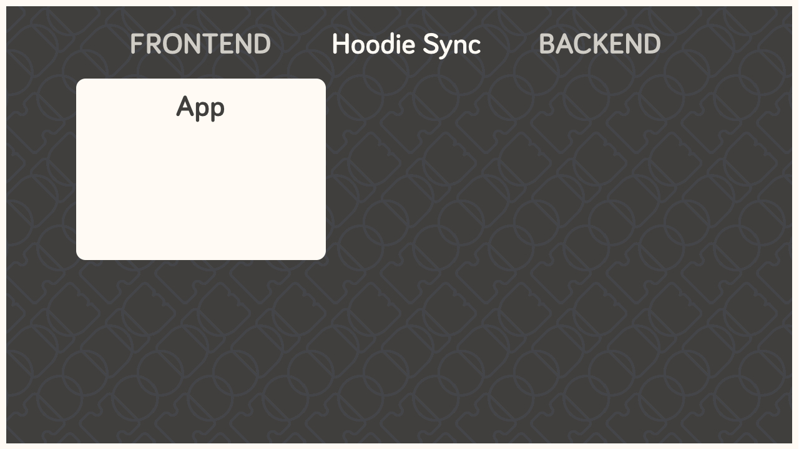
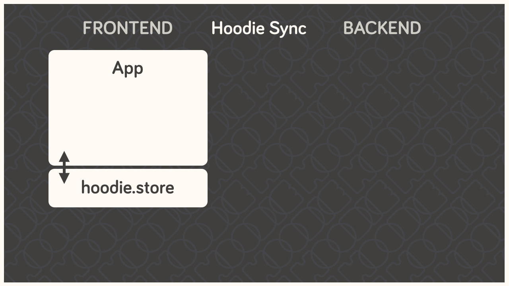
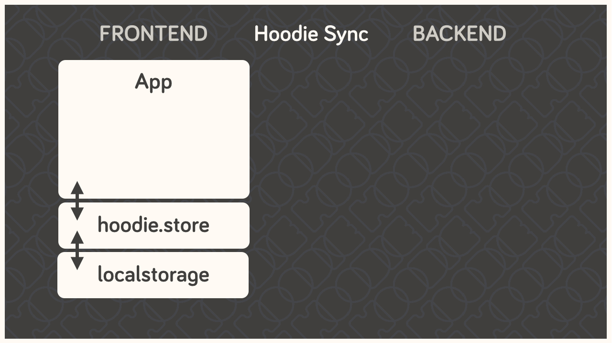
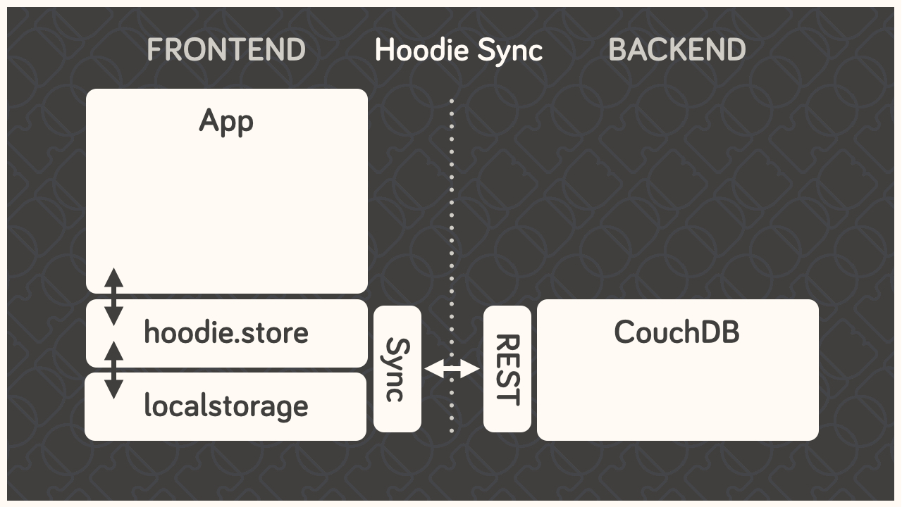
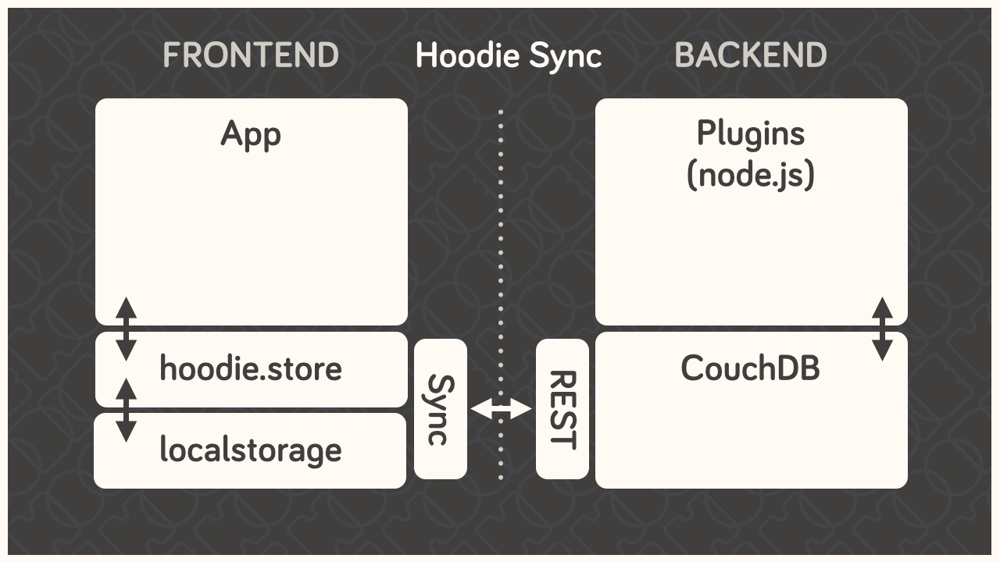

How Hoodie Works
================

Hoodie has several components that work together in a somewhat atypical
way to deliver our promise of simplicity, out-of-the-box syncing, and
offline capability.

Everything starts in the frontend, with your app. This is your user
interface, your client side business logic, etc.

The app code only talks to the Hoodie frontend API, never directly to
the server-side code, the database, or even the in-browser storage.

Hoodie uses PouchDB for storing data locally, which uses IndexedDb or WebSQL,
whatever is available. Hoodie saves all data here first, before doing
anything else. So if you’re offline, your data is safely stored locally.

This, by itself, is already enough for an app. But if you want to save
your data remotely or send an email, for example, you’ll need a bit
more.

Hoodie relies on CouchDB, the database that replicates. We use it to
sync data back and forth between the server and the clients, which is
something that CouchDB happens to be really good at.

*A small aside: In CouchDB, each user has their own private database
which only they can access, so all user data is private by default. It
can be shared to the public if the user decides to do so, but it can’t
happen by accident. This is why we’ll often mention sharing and global
data as a separate feature.*

Behind the database, we have the actual server code in the form of a
small node.js core with various plugins running alongside it. These then
act upon the data in the CouchDB, which then replicates the changes back
to the clients.

So Hoodie does **client ↔ database ↔ server** instead of the traditional
**client ↔ server ↔ database**, and this is where many of its
superpowers come from.

The clever bit is indicated by the dotted line in the middle; the
connection between clients and server can be severed at any time without
breaking the system. Frontend and backend never talk directly to each
other. They only leave each other messages and tasks. It’s all very
loosely-coupled and event-based, and designed for eventual consistency.
